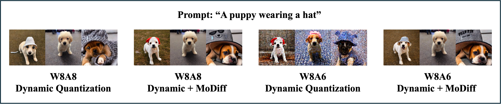
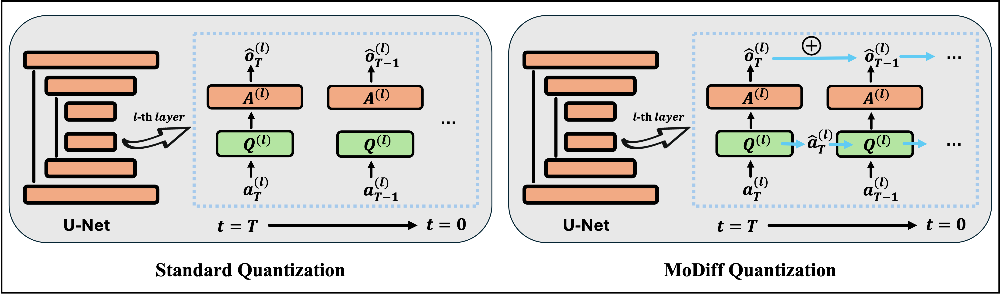

# Modulated Diffusion: Accelerating Generative Modeling with Modulated Quantization

This repository provides the official implementation of our ICML 2025 paper, [Modulated Diffusion: Accelerating Generative Modeling with Modulated Quantization](https://icml.cc/virtual/2025/poster/43551), along with the pretrained checkpoints and the calibrated dataset used for Q-Diffusion. MoDiff is designed to be compatible with any post-training quantization (PTQ) method, enabling lower activation precision (up to 3 bits) without compromising generation quality.


Our MoDiff scales to Stable Diffusion on text-guided image generation. Here is an example on COCO-MS-2014.



## Overview
Diffusion models have emerged as powerful generative models, but their high computation cost in iterative sampling remains a significant bottleneck. In this work, we present an in-depth and insightful study of state-of-the-art acceleration techniques for diffusion models, including caching and quantization, revealing their limitations in computation error and generation quality. To break these limits, this work introduces Modulated Diffusion (MoDiff), an innovative, rigorous, and principled framework that accelerates generative modeling through modulated quantization and error compensation. MoDiff not only inherents the advantages of existing caching and quantization methods but also serves as a general framework to accelerate all diffusion models. The advantages of MoDiff are supported by solid theoretical insight and analysis. In addition, extensive experiments on CIFAR-10 and LSUN demonstrate that MoDiff significant reduces activation quantization from 8 bits to 3 bits without performance degradation in post-training quantization (PTQ).



## Get Started

### Installation
Clone the MoDiff repository and create a conda environment ` modiff ` with the following commands:

```
git clone https://github.com/WeizhiGao/MoDiff.git
cd MoDiff
conda env create -f environment.yml
conda activate modiff
```

If you encounter errors while installing the environment, please manually install the packages with compatible versions.

### Pretrained Model Preparation
Before the quantization, you need to prepare the pre-trained models with the following instructions:

1. Specify the model directory and move ` models ` directory there.

2. For DDIM on CIFAR10, the pre-trained model will be automatically downloaded. You are able to change the saving path in the input args.

3. For Latent Diffusion and Stable Diffusion experiments, we follow the checkpoints in [latent-diffusion](https://github.com/CompVis/latent-diffusion#model-zoo) and [stable-diffusion](https://github.com/CompVis/stable-diffusion#weights) . We use ` LDM-8 ` for LSUN-Churches, ` LDM-4 ` for LSUN-Bedrooms, and ` sd-v1-1.4 ` for MS-COCO. We provide a script for automatically download:
    ```
    cd <model_path>/models
    sh download.sh
    ```

4. Our work targets the activation quantization, and you can use the quantized models weight for any quantization. You should download your quantized model weights to ` quant_models ` directory. We use the checkpoints in [Q-Diffusion](https://github.com/Xiuyu-Li/q-diffusion) and you can download those models from [Google Drive](https://drive.google.com/drive/folders/1ImRbmAvzCsU6AOaXbIeI7-4Gu2_Scc-X).

### Calibration Dataset Generation
If you use dynamic quantization, you can skip this step. For some quantization methods, calibration dataset is required. We provide scipts to generate calibration dataset for MoDiff as follows:

In practice, you only need xxx data, which cost several minites.

### Post-Training Quantization

### Image Generation

### Evaluation

## Citation
If you find this work useful in your usage, please consider citing our paper:
```
TBD
```

## Acknowledgements
Our diffusion model code is developed based on [q-diffusion](https://github.com/Xiuyu-Li/q-diffusion), [ddim](https://github.com/ermongroup/ddim), [latent-diffusion](https://github.com/CompVis/latent-diffusion), and [stable-diffusion](https://github.com/CompVis/latent-diffusion).

We thank [DeepSpeed](https://github.com/microsoft/DeepSpeed) for model sizes and BOPS measurements, and [torch-fidelity](https://github.com/toshas/torch-fidelity) and [guided-diffusion](https://github.com/openai/guided-diffusion) for IS, FID and sFID evaluation.


<!-- ## Checkpoints Downloading
- Download the corresponding pretrained models in https://ommer-lab.com/files/latent-diffusion, and put them into the corresponding folder in ```models/ldm/*```
- Download the quantized checkpoints in Q-Diffusion in https://drive.google.com/drive/folders/1ImRbmAvzCsU6AOaXbIeI7-4Gu2_Scc-X to ```quantized_models```

## Reproduce
To run the experiments with dynamic quantization, please use the following command:
```
python scripts/sample_diffusion_ddim.py --config configs/cifar10.yml --use_pretrained --timesteps 100 --eta 0 --skip_type quad --ptq --weight_bit 4 --quant_mode qdiff --quant_act --act_bit 8 --a_sym --split --resume -l log/data/w4a8 --cali_ckpt quantized_models/cifar_w4a8_ckpt.pth --rt --ds --warm 
```

To run the experiments with Q-diff, please first generate calibration dataset with the following command:
```
python scripts/sample_diffusion_ddim.py --config configs/cifar10.yml --use_pretrained --timesteps 100 --eta 0 --skip_type quad --generate --residual -l logs/cifar10/test --cali_n 2048 --cali_st 20
```

Then run the code to calibarte the model and generate images with the following command:
```
CUDA_VISIBLE_DEVICES=1 python scripts/sample_diffusion_ddim.py --config configs/cifar10.yml --use_pretrained --timesteps 100 --eta 0 --skip_type quad --ptq --weight_bit 4 --quant_mode qdiff --cali_st 20 --cali_batch_size 32 --cali_n 256 --quant_act --act_bit 8 --a_sym --split --cali_data_path logs/cifar10/test/samples/cali_data.pt  -l logs/qdiff/w4a8  --cali_ckpt quantized_models/cifar_w4a8_ckpt.pth --resume_w --ds --warm
``` 